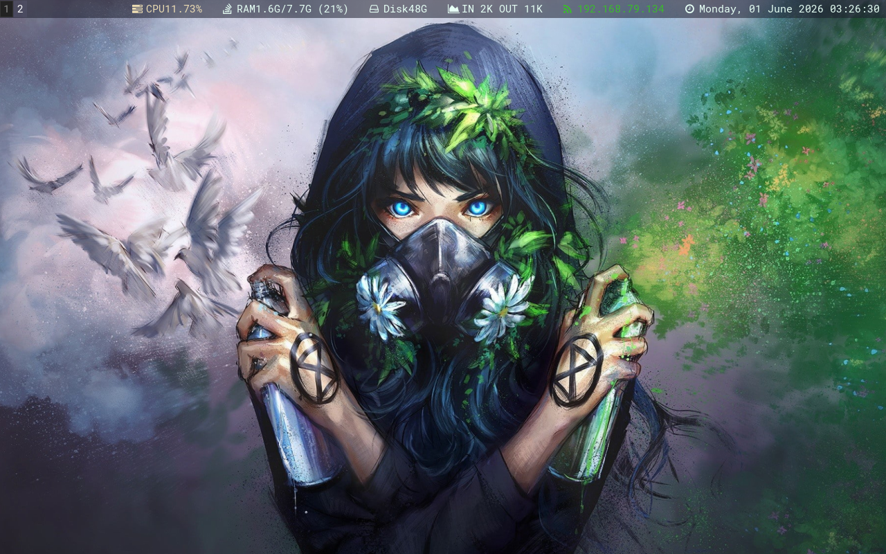
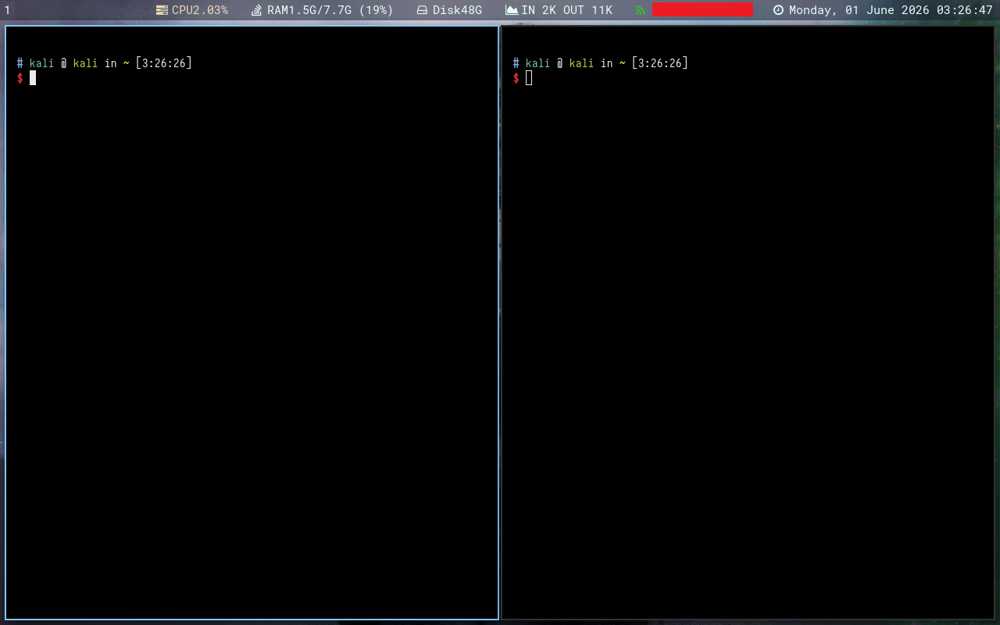

# Kali-Clean

My kali i3 desktop setup. Some people have been asking so I wrote a quick installer to get going. 

After cloning the repo just run ./install.sh from a non-root user. This updates kali and installs a lot of stuff, so it will take a while. Feel free to optimize ;)

## Installation

```
./install.sh
```

After the script is done reboot and select i3 (top right corner) on the login screen. Then open a terminal (`ctrl+return`) run `lxappearance`and select ark-dark theme and change the icons to whatever you like (I used papyrus).

## Screenshots




## 繁體中文說明

這是我在 Kali 上的 i3 桌面環境配置。複製倉庫後，以非 root 使用者執行 `./install.sh` 即可開始安裝。此腳本會更新 Kali 並安裝大量套件，因此需要一些時間，歡迎自行優化 ;)

安裝完成重新開機後，在登入畫面右上角選擇 i3。登入後按下 `ctrl+return` 開啟終端機，執行 `lxappearance` 選擇 ark-dark 主題，並將圖示變更為你喜歡的樣式（我使用的是 Papyrus）。

## Credits

Wallpaper by Wenqing Yan ( https://www.yuumeiart.com/ )

## Changelog

- **2026-06-01**: Initial push & fixes
  - Updated i3blocks config and install script
  - Added i3-gaps as tracked files (fixed nested git submodule issue)
  - Pushed to `donks666-cyber/kali-clean`

## 更新紀錄

- **2026-06-01**：初始推送與修復
  - 更新 i3blocks 配置與安裝腳本
  - 將 i3-gaps 加入版本控制（修復嵌套 git 子模組問題）
  - 推送至 `donks666-cyber/kali-clean`
